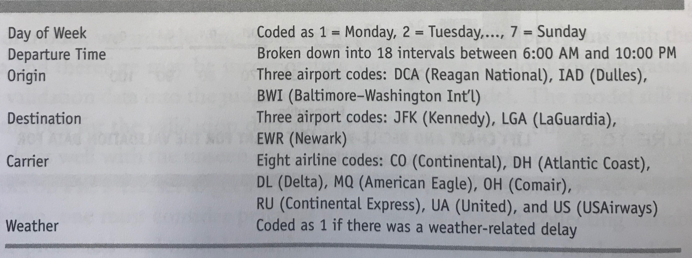

```{r setup, include=FALSE}
knitr::opts_chunk$set(echo = T)
```

##Logistic Regression

Logistic regression is a method for fitting a regression curve, $y = f(x)$, when $y$ is a `binary` variable. The typical use of this model is predicting `y` given a set of predictors `x`. The predictors can be continuous, categorical or a mix of both.

### How does Logistic Regression work?

1. CalculateProbability
2. Classify each example by comparing the predicted probability to a cutoff probability


#### Step 1: Calculate Probability

For Linear Regression, where the output is a linear combination of input feature(s), we write the equation as:
$$
\begin{equation}
Y = \beta_0 + \beta_1x_1 +\beta_2x_2 + \beta_2x_2 + \dots + \beta_px_p
\end{equation}
$$
If Y is a binary variable, we cannot use the above formula directly. Why?

Instead of predicting $Y$ directly, we predict the $P(Y = 1|X)$ in logistic regression, the **probability** of $Y$ being 1 given the feature $X$.

To make sure the output is **indeed** a probability, we need to make sure the outcome meets two criteria.

  * The Y must be positive (greater than 0).
  * It should be lower than 1.

We then can make the following transformations.

$$
p={1 \over {1 + {e^{-(\beta_0 + \beta_1x_1 +\beta_2x_2 + \beta_2x_2 + \dots + \beta_px_p)}}}}
$$
We can write the function in a genral form. We call it losgixtic response functin
$$
f(z) = {1 \over {1 + e^{-z}}}
$$

#### Step 2: Classify each example using by comparing the predicted probability to a cutoff probability

  * If $\hat p \le p_{cutoff}$, then $y=0$
  * If $\hat p > p_{cutoff}$, then $y=1$


## Today's Outline:
 1. Practice 1: Flight delay example
 2. Practice 2: Acceptance of Personal Loan
 
## Practice Example 1: Flight delay example
Predicting flight delays can be useful to a variety of organizations: airport authorities, airlines, aviation authorities. At times, joint task forces have been formed to address the problem. Such an organization, if it were to provide ongoing real-time assistance with flight delays, would benefit from some advance notice about flights likely to be delayed. 


### Data Description
We look at six predictors. The outcome of interest is whether the flight is delayed or not. Our data consist of all flights from the Washington, DC area into the New York City area during January 2004. The percent of delayed flights among these 2201 flights is 19.5%


```{r showdataset, echo=FALSE,size= "10"}
delays.df <- read.csv("FlightDelays.csv")
knitr::kable(head(delays.df[,c("DAY_WEEK","CRS_DEP_TIME","ORIGIN","DEST","CARRIER","Weather","Flight.Status")]))
```



The goal is to predict accurately whether a new flight, not in this dataset, will be delayed or not. The outcome variable is a variable called Flight Status. codded as delayed or on time. 

### Step 1: Preprocess the data

#### Read data
```{r}
# read data
delays.df <- read.csv("FlightDelays.csv")
```

Let’s check out what kinds of variables we have
```{r}
str(delays.df)
```

We cannot use `DAY_WEEK` directly because the class of DAY_WEEK is the **integer**.

Why? (Hint: Consider how we interpret the coefficients)

What about `CRS_DEP_TIME`?

#### Transform Categorical Variables

* `DAY_WEEK` is coded as 1 = Monday, 2 = Tuesday, ... , 7 = Sunday. We want to transform day of week into a categorical variable.
* `CRS_DEP_TIME` is coded as a 4-digit number. (e.g. 1432 = 2:32 PM). We want to bin and categorize the departure time into hourly intervals between 6 AM and 10 PM.
```{r}
# transform variables and create bins
delays.df$DAY_WEEK <- factor(delays.df$DAY_WEEK, levels = c(1:7), 
                             labels = c("Mon", "Tue", "Wed", "Thu", "Fri", "Sat", "Sun"))
delays.df$CRS_DEP_TIME <- factor(round(delays.df$CRS_DEP_TIME/100))
```

We need to set **base level** for the categorial variables. For a categorical variable with $n$ levels, we can only get the coefficients for the $n −1$ levels except the base level. The coefficients for categorical variables are interpreted as how the *current level* influence the dependent variable compared to the *base level*.

```{r}
# create reference categories
delays.df$ORIGIN <- relevel(delays.df$ORIGIN, ref = "IAD")
delays.df$DEST <- relevel(delays.df$DEST, ref = "LGA")
delays.df$CARRIER <- relevel(delays.df$CARRIER, ref = "US")
delays.df$DAY_WEEK <- relevel(delays.df$DAY_WEEK, ref = "Mon")
```

Let's also recode the target variable (`Flight.Status`) to make sure that we know which status is associated with 1. 
We can use `as.numeric` to transform a string factor into a numeric factor.

```{r}
delays.df$isDelay <- as.numeric(delays.df$Flight.Status == "delayed")
```

### Step 2: Partition Data
Now we are ready to generate train and validation set. `selected.var` contains the column numbers of six predictors we use.

```{r}
# create training and validation sets
set.seed(5)
selected.var <- c(10, 1, 8, 4, 2, 9, 14)
train.index <- sample(1:nrow(delays.df), nrow(delays.df)*0.6)  
train.df <- delays.df[train.index, selected.var]
valid.df <- delays.df[-train.index, selected.var]
```

### Step 3: Predict Probability
```{r}
# run logistic model, and show coefficients 
logit.reg <- glm(isDelay ~ ., data = train.df, family = "binomial")
summary(logit.reg)
```

How do you interpret the result? 


$$
log(Odds) = log({p \over {1-p}}) =\beta_0 + \beta_1x_1 +\beta_2x_2 + \beta_2x_2 + \dots + \beta_px_p
$$

  * For dummy variable `DAY_WEEKWed`, compared to Monday (base level), negative coefficient -0.569128 means that it is less likely for flight on Wednesday to delay.
  * Can you interpret other results? 
  
### Step 4: Generate outcome by comparing predicted probability with the cutoff probability

First calculate the predicted probability on validation set
```{r,message=FALSE, warning=FALSE}
# set the cutoff to be 0.5 and evaluate the model
## use predict() with type = "response" to compute predicted probabilities
logit.reg.pred <- predict(logit.reg, valid.df, type = "response")
```

#### Base case: cutoff = 0.5

  * If $\hat p \le 0.5$, then $y=0$
  * If $\hat p > 0.5$, then $y=1$

We can use `ifelse` function to generate outcome. 
* usage: ifelse(test, yes, no)
* test: a logical statement
* yes: the return value if the answer is yes
* no: the return value if the anser is no

```{r}
# Choose cutoff value and evaluate classification performance
pred <- ifelse(logit.reg.pred > 0.5, 1, 0)
```


Calculate the prediction accuracy using confusion matrix.
```{r, warning= FALSE, message= FALSE}
## generate the confusion matrix based on the prediction
library(caret)
confusionMatrix(factor(pred), factor(valid.df$isDelay))
confusionMatrix(factor(pred), factor(valid.df$isDelay))$overall[1]
```
Question: Why do we use `factor(train.df$isDelay)` instead of `train.df\$isDelay' here?

Hint: use `class` to examine the type of the data.

```{r}
class(train.df$isDelay)
```

Let us see the predictive power of this algorithm by comparing the first 5 actual and predicted records.
```{r}
## first 5 actual and predicted records
data.frame(actual = valid.df$isDelay[1:5], predicted = pred[1:5])
```

The accuracy in the training data set is

```{r}
# find out training accuracy
train.pred <- ifelse(logit.reg$fitted.values > 0.5, 1, 0)
confusionMatrix(factor(train.pred), factor(train.df$isDelay))
confusionMatrix(factor(train.pred), factor(train.df$isDelay))$overall[1]
```

#### Change the cutoff value to 0.2
```{r}
# set the cutoff to be 0.2 and evaluate the model
pred <- ifelse(logit.reg.pred > 0.2, 1, 0)
confusionMatrix(factor(pred), factor(valid.df$isDelay))
```

The accuracy in the training dataset
```{r}
# find out training accuracy
train.pred <- ifelse(logit.reg$fitted.values > 0.2, 1, 0)
confusionMatrix(factor(train.pred), factor(train.df$isDelay))$overall[1]
```

Which one is more accurate?

## Practice Example 2: Acceptance of Personal Loan 
This is the example in Session 12
Universal Bank is a relatively young bank that is growing rapidly in terms of overall customer acquisition. The bank wants to explore ways of converting its liability (deposit) customers to personal loan customers.

### Data Description
The bank's dataset includes data on 5000 customers. The data include customer demographic information (age, income, etc), customer response to the last personal loan campaign (Personal Loan), and the customer's relationship with the bank (mortgage, securities account, etc.). Among these 5000 customers only 480 (= 9.6%) accepted the personal loan that was offered to them in the earlier campaign.

```{r, echo=FALSE,size= "10"}
bank.df <- read.csv("UniversalBank.csv")
knitr::kable(head(bank.df[ , -c(1, 5)]))
```

### Questions
1. Import the data from `UniversalBank.csv` and drop ID and zip code columns.

2. Preprocess Education, which is a categorical variable 
    * use `factor` factor the variable
    * use `relevel` to set up the base level

3. Partition the data into 60% training vs. 40% validation with the seed set to 2

4. Run logistic regression. 
    * use `glm` (general linear model) with family = "binomial" to fit a logistic regression

5. Set the cutoff to be 0.5 and evaluate on the validation set. (i.e. generate the confusion matrix)

